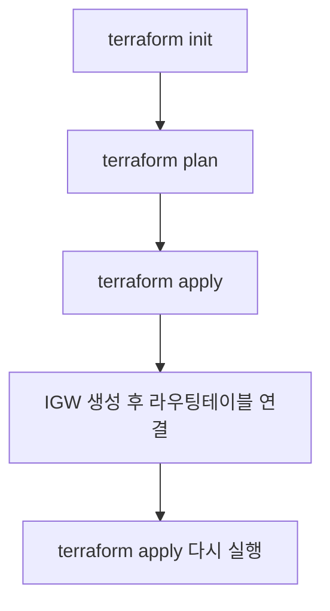

# StatusBoard IaC (NHN Cloud)

Terraform으로 NHN Cloud 인프라를 구성하고 관리

<br/>

## 1️⃣ 인프라 구성 디렉토리 구조
- **compute** : VM, Floating IP 관련
- **network** : VPC, Subnet, Security Group, Routing Table
- **storage** : Block Storage (볼륨, 스냅샷 등)

<br/>

## 2️⃣ 실행 플로우



## 3️⃣ 실행 순서
```bash
1. 초기화
terraform init

2. 계획 확인
terraform plan

3. 인프라 생성
terraform apply

4. 인프라 제거
terraform destroy
```
